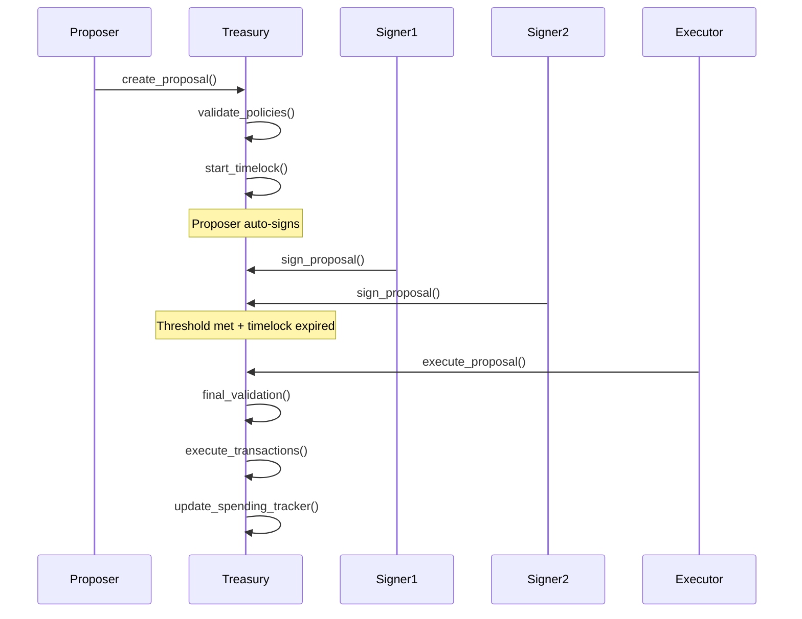
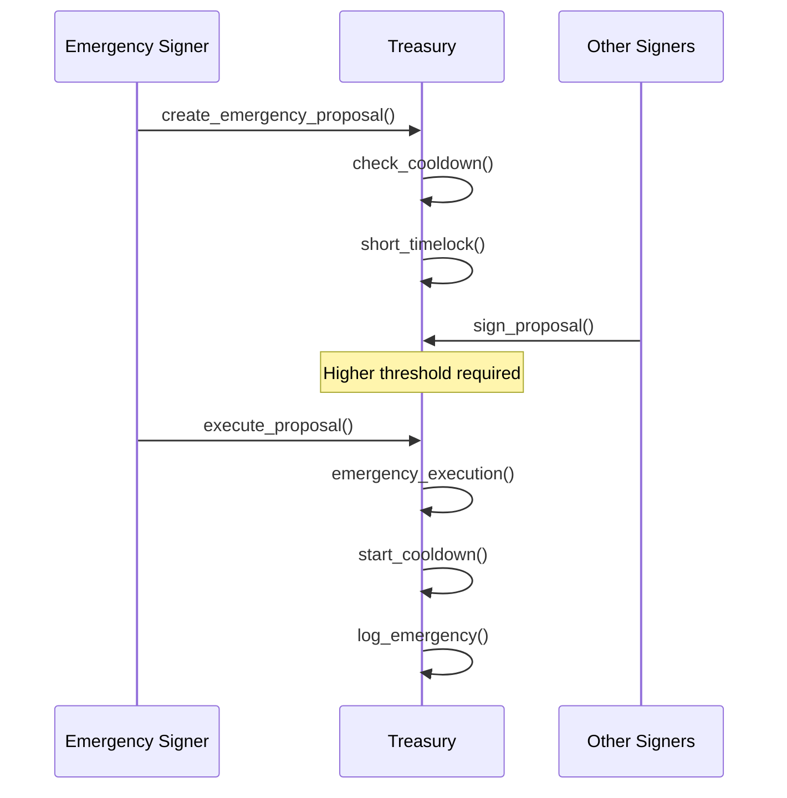

# Multi-Signature Treasury System for Sui

A sophisticated, secure, and flexible multi-signature treasury management system for DAOs and organizations on the Sui blockchain.

- Package ID (Verified): 0x0b7df016c3c95739a210d87f028ee2627b99ff7fb092f9d3666f25ebd0e19aa8

## 🎯 Features

### Core Capabilities
- ✅ **Multi-Signature Security**: Configurable threshold signatures (e.g., 3-of-5)
- ✅ **Programmable Spending Policies**: Category-based limits, whitelists, amount thresholds
- ✅ **Time-Locked Proposals**: Mandatory waiting periods before execution
- ✅ **Batch Transactions**: Execute up to 50 transactions in a single proposal
- ✅ **Emergency Procedures**: Higher threshold withdrawals with cooldown periods
- ✅ **Spending Tracking**: Daily/weekly/monthly limits with automatic resets
- ✅ **Gas Optimized**: Efficient storage patterns and minimal computational overhead

### Policy System
- **Spending Limits**: Per-category and global daily/weekly/monthly limits
- **Whitelists**: Restrict payments to approved addresses
- **Amount Thresholds**: Dynamic signature requirements based on transaction size
- **Time-Lock Scaling**: Larger amounts require longer waiting periods
- **Category Management**: Organize spending into operations, marketing, development, etc.

## 📋 Architecture

### Core Modules

#### 1. Treasury
Main treasury object holding funds and configuration.

**Key Components:**
```rust
public struct Treasury has key, store {
    id: UID,
    name: String,
    signers: vector<address>,
    threshold: u64,
    balance_sui: Balance<SUI>,
    policy_config: PolicyConfig,
    spending_tracker: SpendingTracker,
    emergency_config: EmergencyConfig,
    // ...
}
```

#### 2. Proposal
Manages spending proposals with multi-sig approval.

**Features:**
- Collect signatures from authorized signers
- Time-lock enforcement
- Batch transaction support
- Automatic execution after approval
- Emergency designation

#### 3. PolicyConfig
Defines and enforces spending policies.

**Policy Types:**
- Spending limits (daily/weekly/monthly)
- Whitelisted/blacklisted addresses
- Category-specific thresholds
- Amount-based signature requirements
- Time-lock formulas

#### 4. EmergencyConfig
Handles high-security emergency operations.

**Features:**
- Higher signature threshold
- Treasury freeze capability
- Cooldown periods
- Audit trail

## 🚀 Getting Started

### Installation

1. **Clone the repository:**
```bash
git clone https://github.com/rocknwa/multisig-treasury
cd multisig-treasury
```

2. **Build the project:**
```bash
sui move build
```

3. **Run tests:**
```bash
sui move test
```

### Basic Usage

#### 1. Create a Treasury

```rust
use multisig_treasury::treasury;

// Define signers
let signers = vector[
    @0x1111...,
    @0x2222...,
    @0x3333...,
    @0x4444...,
    @0x5555...
];

// Create treasury with 3-of-5 threshold
let (treasury, admin_cap) = treasury::create_treasury(
    string::utf8(b"DAO Treasury"),
    signers,
    3, // threshold: 3 signatures required
    3600000, // 1 hour base time-lock (in ms)
    1000, // time-lock factor for amount scaling
    ctx
);
```

#### 2. Deposit Funds

```rust
// Deposit SUI into treasury
treasury::deposit_sui(&mut treasury, coin);
```

#### 3. Configure Policies

```rust
// Set spending limit for Marketing category
let limit = treasury::new_spending_limit(
    100_000_000_000, // 100 SUI daily limit
    500_000_000_000, // 500 SUI weekly limit
    2_000_000_000_000, // 2000 SUI monthly limit
    50_000_000_000 // 50 SUI per transaction cap
);

treasury::set_category_limit(
    &mut treasury,
    &admin_cap,
    string::utf8(b"Marketing"),
    limit
);

// Add whitelisted address
treasury::add_whitelist(
    &mut treasury,
    &admin_cap,
    @0xrecipient_address
);
```

#### 4. Create a Proposal

```rust
// Create transactions
let mut transactions = vector::empty();
vector::push_back(&mut transactions, 
    treasury::new_transaction(
        @0xrecipient,
        10_000_000_000, // 10 SUI
        string::utf8(b"Marketing")
    )
);

// Create proposal
let proposal = treasury::create_proposal(
    &mut treasury,
    transactions,
    string::utf8(b"Marketing"),
    string::utf8(b"Q1 Marketing Campaign Payment"),
    ctx
);
```

#### 5. Sign and Execute

```rust
// Other signers sign the proposal
treasury::sign_proposal(&treasury, &mut proposal, ctx);

// Once threshold is met and time-lock expires, execute
treasury::execute_proposal(&mut treasury, &mut proposal, ctx);
```

## 📊 Policy Configuration Examples

### Example 1: Basic DAO Treasury

```rust
// 5 signers, 3 required
let signers = vector[@signer1, @signer2, @signer3, @signer4, @signer5];
let threshold = 3;

// 1 hour base time-lock
let time_lock_base = 3_600_000; // milliseconds

// Set global daily limit: 1000 SUI
let global_limit = treasury::new_spending_limit(
    1000_000_000_000, // daily
    5000_000_000_000, // weekly
    20000_000_000_000, // monthly
    100_000_000_000 // per tx
);
treasury::set_global_limit(&mut treasury, &admin_cap, global_limit);
```

### Example 2: Category-Based Spending

```rust
// Operations: High frequency, lower amounts
let ops_limit = treasury::new_spending_limit(
    100_000_000_000, // 100 SUI/day
    500_000_000_000, // 500 SUI/week
    2000_000_000_000, // 2000 SUI/month
    20_000_000_000 // 20 SUI per tx
);
treasury::set_category_limit(
    &mut treasury,
    &admin_cap,
    string::utf8(b"Operations"),
    ops_limit
);

// Development: Lower frequency, higher amounts
let dev_limit = treasury::new_spending_limit(
    500_000_000_000, // 500 SUI/day
    2000_000_000_000, // 2000 SUI/week
    8000_000_000_000, // 8000 SUI/month
    200_000_000_000 // 200 SUI per tx
);
treasury::set_category_limit(
    &mut treasury,
    &admin_cap,
    string::utf8(b"Development"),
    dev_limit
);
```

### Example 3: Amount-Based Thresholds

```rust
// Small amounts: 2 signatures
treasury::add_amount_threshold(
    &mut treasury,
    &admin_cap,
    treasury::new_amount_threshold(
        100_000_000_000, // up to 100 SUI
        2 // requires 2 signatures
    )
);

// Medium amounts: 3 signatures
treasury::add_amount_threshold(
    &mut treasury,
    &admin_cap,
    treasury::new_amount_threshold(
        1000_000_000_000, // up to 1000 SUI
        3 // requires 3 signatures
    )
);

// Large amounts: 4 signatures
treasury::add_amount_threshold(
    &mut treasury,
    &admin_cap,
    treasury::new_amount_threshold(
        u64::MAX, // any amount above 1000 SUI
        4 // requires 4 signatures
    )
);
```

## 🔒 Security Features

### Multi-Signature Verification
- Cryptographically sound signature collection
- Threshold enforcement
- No signature replay attacks
- Signer authorization validation

### Policy Enforcement
- **No bypass mechanisms**: All transactions validated against policies
- **Atomic execution**: Batch transactions execute all-or-nothing
- **Time-lock protection**: Cannot circumvent waiting periods
- **Input validation**: Comprehensive checks on all parameters

### Emergency Procedures
- Higher threshold requirements (default: threshold + 1)
- 24-hour cooldown between emergencies
- Treasury freeze capability
- Complete audit trail

### Access Control
- Admin capabilities for policy management
- Signer-only proposal creation
- Proper capability management
- Protected administrative functions

## 🧪 Testing

### Run All Tests
```bash
sui move test
```

### Test Coverage
The test suite includes:

**Unit Tests:**
- ✅ Treasury creation (valid/invalid parameters)
- ✅ Deposit operations (single/multiple)
- ✅ Proposal creation (single/batch transactions)
- ✅ Signature collection and verification
- ✅ Policy configuration and enforcement
- ✅ Time-lock mechanics
- ✅ Spending limit validation

**Integration Tests:**
- ✅ Complete proposal lifecycle
- ✅ Multi-signer workflows
- ✅ Policy updates and propagation
- ✅ Edge cases (concurrent operations, boundary conditions)

**Security Tests:**
- ✅ Non-signer rejection
- ✅ Threshold enforcement
- ✅ Time-lock bypass prevention
- ✅ Double-signing prevention
- ✅ Policy violation detection

### Example Test Execution
```bash
# Run specific test
sui move test test_create_proposal_success

# Run with coverage
sui move test --coverage

# Run with gas profiling
sui move test --gas-limit 1000000000
```

## 📈 Gas Optimization

### Efficient Storage Patterns
- Table-based storage for sparse data (spending limits, categories)
- Inline structs for frequently accessed data
- Minimal object allocations

### Computational Efficiency
- Single-pass validation
- Batch processing optimization
- Lazy evaluation where possible
- Smart counter resets

### Gas Benchmarks
Approximate gas costs (testnet):
- Treasury creation: ~0.01 SUI
- Proposal creation: ~0.005 SUI
- Signature addition: ~0.003 SUI
- Proposal execution: ~0.03 SUI (varies with batch size)

## 🔄 Workflows

### Standard Proposal Workflow



### Emergency Withdrawal Workflow



## 📝 API Reference

### Treasury Functions

#### `create_treasury`
```rust
public fun create_treasury(
    name: String,
    signers: vector<address>,
    threshold: u64,
    time_lock_base: u64,
    time_lock_factor: u64,
    ctx: &mut TxContext
): (Treasury, TreasuryAdminCap)
```

#### `deposit_sui`
```rust
public fun deposit_sui(
    treasury: &mut Treasury,
    coin: Coin<SUI>
)
```

#### `create_proposal`
```rust
public fun create_proposal(
    treasury: &mut Treasury,
    transactions: vector<Transaction>,
    category: String,
    description: String,
    ctx: &mut TxContext
): Proposal
```

#### `sign_proposal`
```rust
public fun sign_proposal(
    treasury: &Treasury,
    proposal: &mut Proposal,
    ctx: &mut TxContext
)
```

#### `execute_proposal`
```rust
public fun execute_proposal(
    treasury: &mut Treasury,
    proposal: &mut Proposal,
    ctx: &mut TxContext
)
```

### Policy Functions

#### `set_category_limit`
```rust
public fun set_category_limit(
    treasury: &mut Treasury,
    admin_cap: &TreasuryAdminCap,
    category: String,
    limit: SpendingLimit
)
```

#### `set_global_limit`
```rust
public fun set_global_limit(
    treasury: &mut Treasury,
    admin_cap: &TreasuryAdminCap,
    limit: SpendingLimit
)
```

#### `add_whitelist`
```rust
public fun add_whitelist(
    treasury: &mut Treasury,
    admin_cap: &TreasuryAdminCap,
    addr: address
)
```

### View Functions

#### `get_balance`
```rust
public fun get_balance(treasury: &Treasury): u64
```

#### `get_threshold`
```rust
public fun get_threshold(treasury: &Treasury): u64
```

#### `get_signature_count`
```rust
public fun get_signature_count(proposal: &Proposal): u64
```

## 🎯 Success Metrics

✅ **Security**: 100% policy violation detection  
✅ **Flexibility**: Modular policy architecture  
✅ **Efficiency**: < 0.05 SUI per proposal execution  
✅ **Coverage**: > 80% test coverage  
✅ **Scalability**: Support for multiple treasuries  

## 🤝 Contributing

Contributions are welcome! Please ensure:
1. All tests pass
2. Code follows existing patterns
3. Documentation is updated
4. Gas efficiency is maintained

## 🔗 Resources

- [Sui Documentation](https://docs.sui.io)
- [Move Language Book](https://move-language.github.io/move/)
- [Sui Framework](https://github.com/MystenLabs/sui/tree/main/crates/sui-framework)

## 📞 Support

For questions and support:
- [Email](anitherock44@gmail.com)
 